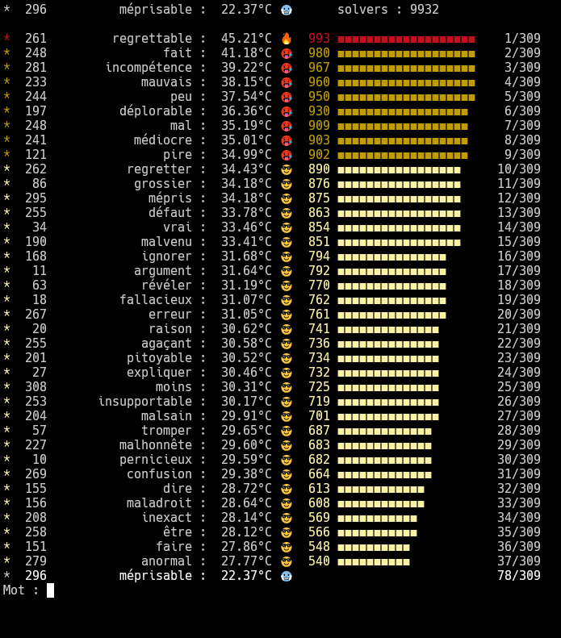

# cemantix-console
My 2 cents on cemantix-console, largely based on [farfabet](https://github.com/farfabet)'s work

Play Cémantix in your shell !

##Supported commands
*(use prefix "/" to indicate you want to enter a command)*
- exit / quit : Self explanatory
- reset / restart : Erase data file and restart the game from start
- nearby : Once you found today's word, you can have a look at all the nearby words
- history : Displays a list of the latest words

##To-Do
- [X] History (previous words and their status "found"/"not found")
- [X] New commands (/history, /exit, /quit, /reset, /restart)
